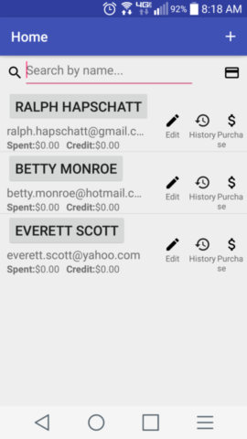
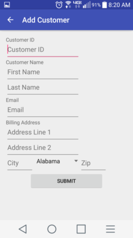
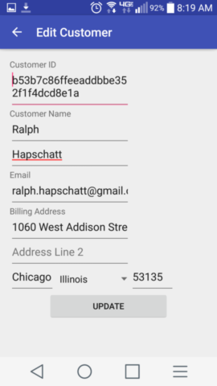
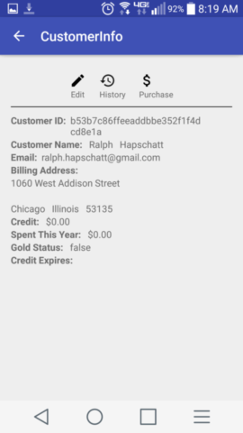
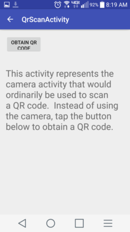
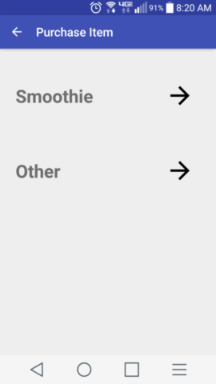
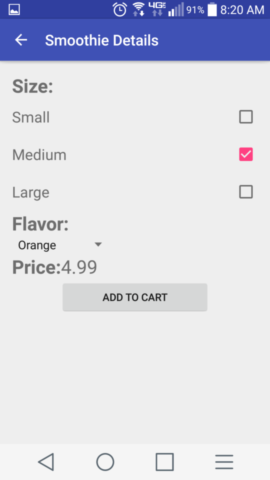
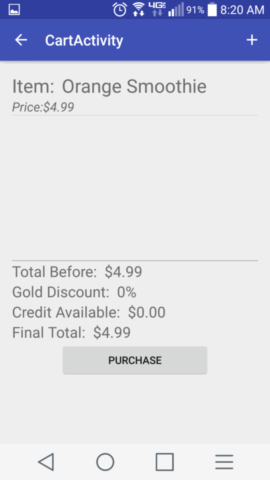
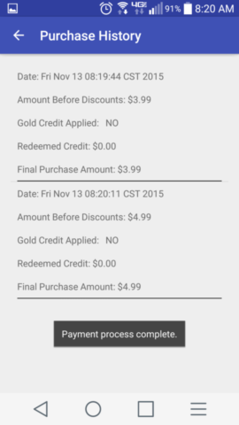

# Design Document

**Author**: Team35

## 1 Design Considerations

### 1.1 Assumptions

As stated in the requirements, this system is to operate on an Android device running an Android operating system.  The sole user of the system is to be the smoothie cart manager. The primary use of the system will be to maintain customer information and purchase records and manage and track purchases and rewards.

Several assumptions have been made:
* The device has unlimited access to the Internet (for use of the payment and email systems)
* The device has adequate storage to house all necessary data (Customer records)
* The system will have access to a credit card scanning system with some form of API
* The system will have access to an email server with an API capable of sending unlimited emails
* The system will have access to a payment processing system with an API capable of processing credit card transactions.

### 1.2 Constraints

Several constraints were taken into account when designing the system.
* The system shall operate on only 1 Android device.  Capability for multiple networked devices shall not be included in this implementation.
* Only 1 user, the manager, will interface with the single device.
* The system shall target an Android version of 5.0 or newer.
* The system has no capability to print out physical receipts and as such must email receipts to customers.
* The system has no backup capabilities either of users or purchases.
* The system shall accept only credit card payments.

### 1.3 System Environment

The system will operate on an Android device running an Android operating system.  The main logic of the application will be developed as an Android application.  The main software, housed in the Android app, must interact with several additional hardware and software systems.  The application must interact with the Android SQLite Database system to store and persist data.  The application must interact with the Android device camera to scan QR codes.  An external email server/system must be interfaced with the application to provide the required email services.  The application must interface with a credit card scanning hardware component and software API.  Additionally, the application will be required to interface with an external payment system to process credit card payments.

## 2 Architectural Design

### 2.1 Component Diagram

The majority of the application components will be housed in the Android device itself.  Nonetheless, the Android device and application must still interface with substantial external components, namely a credit card scanner, email system, and payment processing system.  The majority of the logic of the system will be housed in the Android application.  Data persistence will be provided through the SQLite system/API provided by the Android operating system.  The Android device camera will be used to scan QR codes on the issued customer cards.  The email system will be used to issue the emails stated in the requirements.  Similarly, the payment system will be used to process payments and the credit card scanner will be used to scan credit cards (in preparation for payment processing).  Finally, the Android device display will be the sole user interface for the entire system and must be used to display all data to the manager and retrieve all data from the manager.

### 2.2 Deployment Diagram

The Android device will be used to support the system logic, store all data, interact with the user, and scan QR codes.  An external credit card scanner system will provide the functionality to scan credit cards.  Since a standard Android device does not have the hardware to scan credit cards, this piece of the application must be housed, at least in part, on a separate piece of hardware.  Additionally, Android devices are not capable of connecting into the financial system to directly process payments.  Thus, an external system that exposes an API must be utlized.  This system must be housed on an external server capable of connecting to the primary financial system.  Similarly, typical Android devices are not capable of operating as email servers.  Thus, an external email server (usually housed on some form of a web server) must be utilized.

## 3 Low-Level Design

This section provides a lower level of design for each of the system components identified in the Component Diagram above.  Note that some of the system components are commercial, pre-built, externally-provided systems on their own.  As such, access to the internal design specs of such systems is typically not provided.  Instead, the API features utilized by the application will be discussed.

* SQLite Database: The SQLite Database system is part of the Android operating system that is exposed to developers for use in any application they wish to develop.  It provides Android applications with SQL database capabilities for data storage and persistence and efficient retrieval of large amounts of data.  The exact details of the internal structure of this component are not to be designed in the project and as such are outside the scope of this document.  This system provides Android applications with the capability to store information as records and to associate those records with each other (among other capabilities).  These two requirements are the main features of the database system that will be required by the SmoothieCart system.
* Display (UI): This component represents the sole user interface for the SmoothieCart system.  The Android application will utilize XML documents to describe the views to be presented to the user.  Additional features of the XML documents will be used to bind any user input (including taps and presses) to the SmoothieCart application logic.
* Phone Camera (QR Code Scanner): The built-in camera on the Android device will be utilized to scan QR codes on customer cards.  The API must be capable of converting the QR codes to unique 32 bit hexadecimal IDs.
* Credit Card Scanner: This component will provide the system with the functionality to scan credit cards. The scanner system must be capable of extracting the following information upon card swipe:
    * Cardholder name
    * Account number
    * Expiration date
    * Security code
* Email System: This component provides the system with the capability of sending emails.  The email component must allow the application logic to specify the exact content, subject, recipients, and any other fields typically associated with a standard email.
* Payment System:  This component allows the system to connect to an external system capable of processing credit card payments.  The system must be capable of processing payments of varying amounts using the information retrieved from the credit card scanner component.
* App: This component represents the main logic of the SmoothieCart system and will be developed as an Android application.  Low level details of this component are detailed in the Class Diagram provided below in section 3.1.

### 3.1 Class Diagram

## 4 User Interface Design

The following images provide examples of the different screens to be displayed by the application.  These images are notional and are not intended to represent the full functionality of the system.

##### Home Screen

##### Add Customer Screen

##### Edit Customer Screen

##### Customer Info Screen

##### QR Scan Screen

##### Purchase Screen

##### Smoothie Details Screen

##### Cart Screen

##### Purchase History Screen

