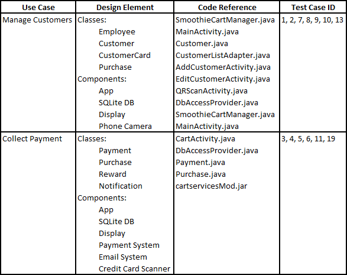

# Traceability Document

**Author:**  Team35

## 1 Introduction

This document provides requirements traceability for the SmoothieCart application.  The table below provides a  mapping from use case, to the design elements that realize that use case, the code that corresponds to those design elements, and the test cases that were derived from the use case.

## 2 Traceability Map

