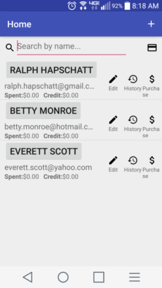
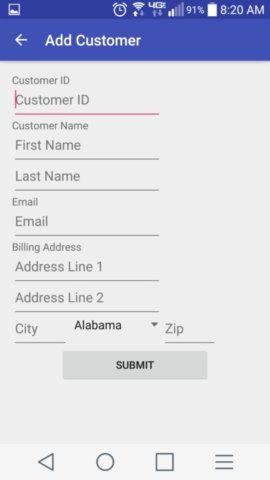
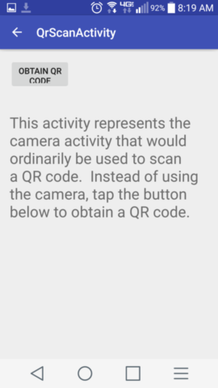
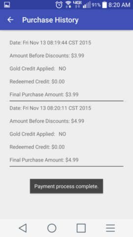
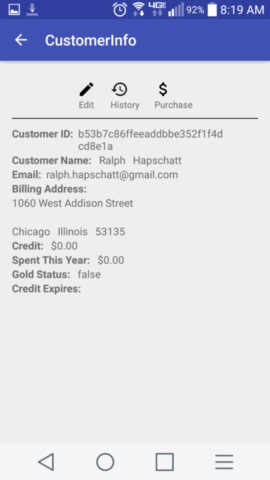
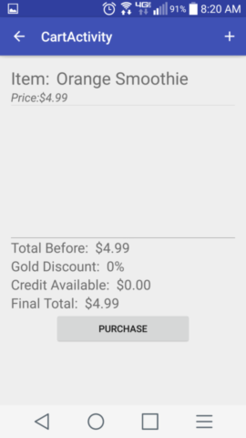

# SmoothieCart User Manual

**Author:**  Team35

## 1 Introduction

SmoothieCart is a custom-designed Android application that provides payment processing and rewards program management for a small smoothie cart business. This application is limited to a single user operating on a single device.  While the design and layout of the application were created to be simple and easy-to-use, this manual is provided so that the user may have a clear, concise, and complete set of operating instructions. 

## 2 Launching the Application

To launch the SmoothieCart application the user should locate the SmoothieCartManagerApp icon on the device.  This icon should be located in one of the pages of the Apps menu.  Selecting this icon will launch the application and the Home screen will be displayed.  From the Home screen, the user will be able to access all the functionality of the application.
* View a list of all customers stored in the datatbase
* Search the database for a specific customer
  * Search by customer name
  * Scan QR code located on customer loyalty card
* Add new customers to the database
* Edit the information of existing customers
* View the purchase history of a customer
* Begin the purchase process
 
See the figure below for an example of the Home screen.

## 3 Managing Customers & Rewards

The following sections detail how to add a customer to the database, how to edit existing customer information, and how to search for an existing customer.  It is important to note that when launching the application for the first time, the database will be empty.  Therefore, a customer must be added to the database before any transactions can be completed

### 3.1 Adding a Customer to the Database

Anytime a new customer (one that doesn't exist within the database) wishes to make a purchase, that customer must be entered into the database and provided a loyalty card.  To add a new customer:

1. From the Home screen select the '+' in the top right corner.  This will open the Add Customer screen. 
2. Within the Add Customer screen enter the following information for the customer in the appropriate fields.
  * First Name
  * Last Name
  * Email
  * Billing Street Address
  * Zip Code
  * State
  
3. After confirming that the correct information has been entered, select the 'Submit' button.  This save the new customer information in the database and will return the user to the Home screen. 

*Note: At any point, the user can cancel/return to the previous screen by selecting the left-pointing arrow in the top left corner of the app.*

### 3.2 Searching for an Existing Customer

Prior to making a transaction or editing customer information, the user must first identify the appropriate customer.  This can be accomplished by searching for the customer by name, or by scanning the QR code located on the loyalty card of the customer.

To search for a customer by name perform the following steps:

1. From the Home screen, select the search bar.  This will activate the keyboard.
2. Begin typing the name of the customer (first name then last name).
3. This will automatically filter the results to the customers whose names match the entered text. 

To search for a customer by loyaly card QR code peform the following step:

1. From the Home screen, select the card icon.  This will activate the device camera and display the contents within the field of view.
2. Place the loyalty card in the field of view of the camera.
3. Once the camera has successfully read the QR code, the customer information will be displayed. 

*Note: At any point, the user can cancel/return to the previous screen by selecting the left-pointing arrow in the top left corner of the app.*

### 3.3 Editing Existing Customer Information

From time to time it may be necessary to edit the information associated with an existing customer.  Editing may be required due to misentered information or at the request of the customer (e.g. a name change, moved residences, etc.).  The following steps may be taken to edit customer information:

1. Follow the steps listed in Section 3.2 to search for the desired customer.
2. Select the 'Edit' option associated with that customer.  This will open the Edit Customer screen.
3. From the Edit Customer screen the following fields are available for editing:

  * First Name
  * Last Name
  * Email
  * Billing Street Address
  * Zip Code
  * State

4. After making all desired changes and confirming their correctness, the user can select the 'Update' button.  This will update the information assocaited with that customer in the database and return the user to the Home screen.

 
*Note: At any point, the user can cancel/return to the previous screen by selecting the left-pointing arrow in the top left corner of the app.*

### 3.4 View Customer Purchase History 

To view the purchase history of a given customer, perform the following steps:

1. Follow the steps listed in Section 3.2 to search for the desired customer.
2. Select the 'History' option associated wih that customer.  This will display all previous purchases associated with that customer.

*Note: At any point, the user can return to the previous screen by selecting the left-pointing arrow in the top left corner of the app.*

### 3.5 Determine Customer Gold Status

To determine if a customer has achieved Gold Status perform the following steps:

1.  Follow the steps listed in Section 3.2 to search for the desired customer.
2.  On the Home Screen, the dollar amount next to the Spent field associated with the customer will be in yellow text if Gold Status has been acheived. 
3.  Alternately, select the customer's name.  This will cause the CustomerInfo screen to be displayed.
4.  From within the CustomerInfo screen the Gold Status field will be set to either 'true' or 'false'.

### 3.6 View Available Customer Credits

To determine if a customer has any reward credits perform the following steps:

1.  Follow the steps listed in Section 3.2 to search for the desired customer.
2.  From the Home screen select the customer's name.  This will cause the CustomerInfo screen to be displayed.
3.  From within the CustomerInfo screen the Credit field will indicate the remaining credit balance and the Credit Expires field will provide the exiration date for the credit.

## 4 Making a Sale

The steps detailed in this section describe the steps necessary to make a sale using the SmoothieCart sytem.

1. From the Home screen follow the steps in Section 3.2 to find the desired customer.
2. Select the 'Purchase' icon associated with the desired customer to display the Purchase Item screen.

3. Select either 'Smoothie' or 'Other'.  Selecting 'Smoothie' allows for selection of predefined smoothie options.  Selecting 'Other' allows for custom smoothies to be sold. (If 'Smoothie was selected proceed to step 4.  If 'Other' was selected proceed to step 5).
4. The SmoothieDetailActivity screen will be displayed. Select the size and flavor of the smoothie.  (Go to step 6)

5. The OtherDetailActivity screen will be displayed.  In this screen, the user must enter the price for the sale item based on the custom smoothie that was requested by the customer.
6. Select the 'Add to Cart' button to add this item to the purchase.  This will display the CartActivity screen.

7. From the cart activity screen the user can add additional sale items by selecting the '+' icon in the top right corner (if this option is selected, return to step 3).  The user may also select the 'Purchase' button.  On this screen the following information is displayed to the user:
  * Total prediscounted purchase price
  * Gold member discount percentage
  * Reward credits available
  * Total price after applying discounts
  
8. Selecting 'Purchase' in the CartActivity screen prompts the user to swipe the credit card of the customer.  After a successful transaction the user is returned to the Home screen.  If the transaction is unsuccessful, an error is displayed and the user is directed to retry the transaction.

*Note: At any point, the user can return/cancel the sale by selecting the left-pointing arrow in the top left corner of the app.* 
